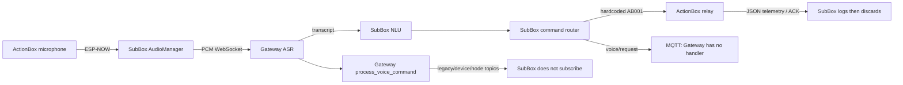

# Rà soát logic và hiệu năng hệ thống

Ngày: 2026-09-29. Phạm vi: code hiện hành của Gateway, ActionBox và SubBox;
không xét archive. Không sửa code chạy, không flash, không gửi lệnh tới thiết bị.

**Kết luận:** Có lỗi về quyền sở hữu bộ nhớ, tính đúng của lệnh, giao thức giữa
các tầng và xác nhận trạng thái. Cần xử lý chúng trước các tối ưu nhỏ về chuỗi
hay tốc độ parser. Build thành công và test NLU Gateway đạt không chứng minh
luồng điều khiển ba tầng hoạt động đúng.

P1: cần sửa trước khi tin cậy vận hành/mở rộng nhiều node.
P2: cần xử lý để chạy lâu, phục hồi và mở rộng ổn định.
“Xác minh code” là đường thực thi đã đối chiếu; không đồng nghĩa đã tái hiện
crash hoặc đo độ trễ trên ESP32/Pi4 thật.

## Luồng thực tế và chỗ đứt

## 1. P1 — Queue SubBox sao chép thô object có std::string

- [Tạo queue](../Firmware/firmware_esp/SubBox/src/system/task_manager.cpp#L58)
  dùng `sizeof(CommandResolution)`;
  [gửi](../Firmware/firmware_esp/SubBox/src/system/task_manager.cpp#L96) và
  [nhận](../Firmware/firmware_esp/SubBox/src/system/task_manager.cpp#L153)
  trực tiếp object.
- [CommandResolution](../Firmware/firmware_esp/SubBox/src/nlu/context/context_manager.h#L13)
  chứa `std::string origin_node_id` và `error_reason`.
- FreeRTOS queue chép byte, không gọi copy constructor/destructor. Sau khi
  biến `res` trong `nluTask` hết vòng lặp, chuỗi ở phía nhận có thể trỏ vào bộ nhớ
  đã giải phóng hoặc vùng lưu nội bộ của object nguồn. Nguy cơ hỏng chuỗi,
  use-after-free và invalid free; độ dài chuỗi nhỏ không làm kiểu này an toàn.
- **Sửa:** queue item chỉ chứa enum/số/mảng `char` có kích thước cố định; chuyển
  sang object C++ ở consumer. Đây là cách đơn giản hơn tự quản lý con trỏ heap.
- **Bằng chứng:** đối chiếu struct và API FreeRTOS trong SDK cài tại máy;
  chưa chủ động gây crash trên board.

## 2. P1 — SubBox có thể biến câu phủ định thành lệnh bật

- [IntentParser::parse](../Firmware/firmware_esp/SubBox/src/nlu/intent/intent_parser.cpp#L87)
  trả `TURN_ON` khi có từ `bật`, không kiểm tra phủ định trước đó.
- `đừng bật đèn` và `không bật quạt` vẫn chứa từ nguyên vẹn `bật`; normalizer
  không xóa động từ, ContextManager cũng không có chốt từ chối phủ định.
- Gateway có kiểm tra phủ định, nhưng firmware SubBox dùng parser khác; kết quả
  test Gateway không bảo vệ đường local này.
- **Sửa:** từ chối phủ định trước phân loại hành động; dùng chung bộ câu kiểm
  thử giữa hai parser. Với câu hỏi như `đèn đang bật không`, phải phân biệt
  truy vấn và yêu cầu thay đổi trạng thái.
- **Bằng chứng:** xác minh đường code normalizer → parser → context → router.

## 3. P1 — Ngưỡng confidence của Gateway bị bỏ qua ở SubBox

- Gateway [gửi transcript ngay cả khi confidence thấp](../Gateway/gateway/audio_server.py#L524),
  rồi dừng xử lý lệnh ở phía Gateway.
- SubBox [nhận transcript](../Firmware/firmware_esp/SubBox/src/audio/asr/ws_asr.cpp#L247),
  lưu confidence nhưng vẫn đặt `m_has_final = true`;
  [AudioManager](../Firmware/firmware_esp/SubBox/src/audio/audio_manager/audio_manager.cpp#L275)
  đưa text sang NLU mà không kiểm tra điểm tin cậy.
- **Hậu quả:** Gateway đã từ chối nhận dạng không chắc chắn, nhưng SubBox vẫn
  có thể bật/tắt relay từ chính kết quả đó.
- **Sửa:** thể hiện rõ transcript được chấp nhận/từ chối trong giao thức;
  SubBox chỉ tạo command từ kết quả được chấp nhận, giữ confidence tới bước này.
- **Probe:** với ASR giả trả `bật đèn`, confidence `0.01`, Gateway thực sự gửi
  `{"type":"transcript","text":"bật đèn","confidence":0.01}`.

## 4. P1 — Giao thức MQTT ba tầng chưa được nối hoàn chỉnh

- SubBox [publish/subscribe](../Firmware/firmware_esp/SubBox/src/mqtt/subbox_mqtt_client.cpp#L20)
  ở `home/subbox/{id}/voice/request`, `/command`, `/voice/response`.
- Gateway [đăng ký handler](../Gateway/gateway/main.py#L118) không có
  `home/subbox/+/voice/request`. [Lệnh relay](../Gateway/gateway/mqtt_handler.py#L83)
  lại đi qua `smarthome/cmd/...`, `home/devices/...`, `home/nodes/...`.
- Ngoài ra, `registerCommandCallback` và `registerVoiceResponseCallback` của
  SubBox chỉ có khai báo/định nghĩa, chưa có nơi gọi trong code khởi tạo hiện hành.
- **Hậu quả:** lệnh liên phòng/phức tạp được báo là đã chuyển đi nhưng thiếu
  consumer; ngay cả publish đúng `/command` cũng chưa có callback thực thi.
- **Sửa:** chọn một hợp đồng MQTT, nối cả hai chiều và đăng ký callback;
  tránh phát cùng một thao tác ra ba topic như giải pháp thay cho routing.
- **Probe:** dùng topic matcher thật và publisher mock: 0 subscriber khớp
  voice request; cả ba topic relay của Gateway đều không khớp SubBox command.
- Không giả định có bridge ngoài repository để lấp chỗ trống này.

## 5. P1 — Một câu nói có hai nơi quyết định/thực thi

- SubBox dùng Pi4 làm ASR, rồi [tự chạy NLU/router](../Firmware/firmware_esp/SubBox/src/system/task_manager.cpp#L128).
- Gateway sau khi gửi transcript vẫn [gọi process_voice_command](../Gateway/gateway/audio_server.py#L545).
  Cờ `speaker:false` chỉ loại node khỏi nhóm loa, không chuyển pipeline sang ASR-only.
- **Hậu quả hiện tại:** xử lý intent/TTS thừa, kết quả hai phía có thể khác nhau.
  Khi sửa routing, nguy cơ thực thi trùng sẽ xuất hiện nếu giữ cả hai nhánh.
- **Sửa:** chốt một nơi sở hữu quyết định cho mỗi request. Với cấu trúc hiện
  có, thêm chế độ ASR-only rõ ràng cho SubBox; Gateway chỉ xử lý hành động khi
  nhận yêu cầu chuyển tiếp có request ID. Không để hai tầng cùng tự quyết.
- **Probe:** gọi `_process_audio` với `client_node_id='subbox_001'` vẫn ghi nhận
  một lần gọi `process_voice_command` sau khi trả transcript.

## 6. P1 — Định danh ESP-NOW bị cố định vào một ActionBox

- [Router](../Firmware/firmware_esp/SubBox/src/actionbox/router/command_router.cpp#L158)
  dùng `AB001` thay cho node vừa tìm được.
- [Transport nhận audio](../Firmware/firmware_esp/SubBox/src/audio/audio_transport/espnow_audio_transport.cpp#L66)
  cũng gán mọi nguồn thành `AB001`; gói JSON ghi MAC mới đè lên cùng khóa.
- **Hậu quả:** thêm ActionBox thứ hai không tạo được nguồn độc lập. Board đã
  đổi ID có thể từ chối lệnh; nhiều board cùng ID mặc định có thể cùng nhận
  broadcast. Không thể bảo đảm “node được chọn” chính là node được điều khiển.
- **Sửa:** giữ ánh xạ MAC ↔ node ID khi đăng ký, phân biệt ID board và ID kênh;
  gửi đúng board/channel trong kết quả phân giải.

## 7. P1 — “Thành công” chưa có xác nhận từ thiết bị

- [Router SubBox](../Firmware/firmware_esp/SubBox/src/actionbox/router/command_router.cpp#L90)
  cập nhật cache và tạo câu `Đã bật...` trước gửi; bỏ qua return của `sendCommand`.
- [Nhánh JSON RX](../Firmware/firmware_esp/SubBox/src/audio/audio_transport/espnow_audio_transport.cpp#L138)
  chỉ log/lưu MAC rồi return. `ActionBoxRegistry::updateTelemetry` không có
  caller trong firmware hiện hành. ACK, fault và trạng thái nút bấm không cập
  nhật registry. Node mặc định sẽ bị đánh offline sau timeout dù còn hoạt động.
- [Gateway verifier](../Gateway/gateway/verify_engine.py#L79) cũng trả success
  ngay khi công suất cũ bằng 0 và không có cờ PZEM; nhánh khác chỉ chờ tối đa
  200 ms, trong khi ActionBox có chu kỳ telemetry cấu hình 1.000 ms.
- **Hậu quả:** gửi thất bại, relay bị khóa fault, hoặc người dùng bấm nút local
  nhưng UI/giọng nói vẫn thể hiện trạng thái suy đoán.
- **Sửa:** tách `pending` khỏi `confirmed`; đối chiếu ACK bằng request ID,
  cập nhật trạng thái từ thiết bị, có timeout. Chênh lệch công suất là kiểm tra
  bổ sung theo kênh và độ mới mẫu, không thay ACK bằng việc publish thành công.
- **Probe:** publisher giả chỉ nhận lệnh, không trả ACK/telemetry, verifier vẫn
  trả `success`.

## 8. P1 — Mất dữ liệu cảm biến không kích hoạt chính sách bảo vệ

- [sensor_task](../Firmware/firmware_esp/ActionBox/src/system/task_manager.cpp#L74)
  chỉ đẩy mẫu khi đọc BL0942 trả `ESP_OK`.
- [safety_task](../Firmware/firmware_esp/ActionBox/src/system/task_manager.cpp#L93)
  vẫn feed watchdog khi không có mẫu; [supervisor](../Firmware/firmware_esp/ActionBox/src/safety/safety_supervisor.cpp#L72)
  bỏ qua mẫu invalid. Không có kiểm tra độ tuổi mẫu ở đường bật relay.
- **Hậu quả:** UART/cảm biến hỏng lâu, task vẫn sống và relay có thể tiếp tục
  bật trong khi chức năng giới hạn dòng không có dữ liệu để hoạt động.
- **Sửa:** theo dõi last-valid-sample theo kênh; có trạng thái SENSOR_FAULT và
  chính sách rõ ràng khi hết hạn mẫu, đồng thời chặn bật lại theo chính sách đó.
  Ngưỡng/thời gian phải được kiểm chứng với phần cứng thật.
- **Bằng chứng:** xác minh nhánh lỗi từ driver tới supervisor; chưa thử ngắt
  cảm biến trên board.

## 9. P1 — Đường cắt relay có thể bị chặn bởi delay bật relay khác

- [relay_on](../Firmware/firmware_esp/ActionBox/src/drivers/relay/relay_driver.cpp#L147)
  giữ mutex chung rồi `vTaskDelay` để giãn lần bật; khoảng cấu hình là 150 ms.
- [relay_set_fault](../Firmware/firmware_esp/ActionBox/src/drivers/relay/relay_driver.cpp#L255)
  phải chờ chính mutex đó trước khi cắt.
- **Hậu quả:** dù safety task ưu tiên cao, yêu cầu cắt vẫn có thể chờ phần
  delay còn lại của thao tác bật. Priority inheritance không bỏ qua delay.
- **Sửa:** không ngủ khi đang giữ khóa cần cho cắt fault; lập lịch lần bật
  sau, còn fault-off phải có đường xử lý ưu tiên và trạng thái latch nhất quán.
- 150 ms là giới hạn delay từ code, không phải số đo thời gian cắt tải thực tế.

## 10. P1 — Audio SubBox có đường chặn tác vụ Wi-Fi

- Callback ESP-NOW [gọi trực tiếp AudioManager](../Firmware/firmware_esp/SubBox/src/audio/audio_transport/espnow_audio_transport.cpp#L84).
- [ingestAudioPacket](../Firmware/firmware_esp/SubBox/src/audio/audio_manager/audio_manager.cpp#L109)
  khóa mutex; STREAM_START còn gọi `WsASR::start`, có gửi WebSocket timeout 1 s.
- [process](../Firmware/firmware_esp/SubBox/src/audio/audio_manager/audio_manager.cpp#L203)
  giữ cùng mutex khi `feedAudio`; [gửi WS](../Firmware/firmware_esp/SubBox/src/audio/asr/ws_asr.cpp#L150)
  cũng có thể đợi tới 1 s. Callback RX sẽ chờ mutex khi mạng chậm.
- SDK ESP-IDF của máy nêu callback RX chạy trong Wi-Fi task và yêu cầu đẩy
  việc dài sang queue. Cấu trúc hiện tại làm tác vụ nhận mạng phải chờ I/O mạng.
- **Sửa:** callback chỉ chép packet vào queue có giới hạn và return; audio
  task thực hiện ASR/I/O, thả khóa trạng thái trước khi gửi WS.
- **Mức xác minh:** đường chặn là có thật trong code; tỷ lệ mất packet/độ trễ
  và khả năng watchdog reset cần đo dưới tải và khi Pi4/mạng mất kết nối.

## 11. P2 — ASR đồng bộ chặn event loop Gateway

- [AudioServer](../Gateway/gateway/audio_server.py#L511) gọi hàm inference đồng
  bộ ngay bên trong coroutine. Trong thời gian đó event loop không chạy các
  callback MQTT/WS/HTTP khác trên cùng loop.
- **Probe có kiểm soát:** thay ASR bằng hàm đồng bộ 150 ms, timer 10 ms của
  cùng event loop chạy sau 153,3 ms. Đây là phép thử cách lập lịch, không phải
  benchmark tốc độ model Sherpa trên Pi4.
- **Sửa:** một worker inference có giới hạn concurrency, dùng executor/
  `asyncio.to_thread` và semaphore nếu model không cho phép chạy đồng thời;
  giới hạn hàng đợi và trả busy khi quá tải.

## 12. P2 — Ghi registry làm lại công việc cho toàn bộ node

- [update_relay_state](../Gateway/gateway/registry_manager.py#L441) gọi save;
  [save](../Gateway/gateway/registry_manager.py#L318) viết lại JSON rồi sync
  từng node sang SQLite bằng thao tác đồng bộ.
- **Probe:** registry giả 50 node, thay đổi một relay dẫn tới 50 lần gọi
  `_sync_node_to_sqlite`. Đếm số lần gọi thực tế, không đo thời gian SD card.
- Nếu mỗi node gửi trạng thái đều đặn và mỗi cập nhật đi qua đường này,
  tổng số lần sync tăng theo N² so với số node.
- **Sửa:** cập nhật đúng node thay đổi; trạng thái runtime không cần ghi lại
  toàn bộ cấu hình. Gom transaction và đưa I/O ra khỏi event loop; chưa cần
  thêm Redis hay một tầng cache mới.

## 13. P1 — Context intent dùng chung giữa các nguồn nói

- Gateway có [một IntentEngine](../Gateway/gateway/main.py#L69), và
  [extract](../Gateway/gateway/main.py#L250) không nhận client ID; engine có
  [một context_manager](../Gateway/gateway/intent_engine.py#L932).
- Phiên hỏi bổ sung ở DialogManager được chia client, nhưng context kế thừa
  bên trong IntentEngine vẫn dùng chung.
- **Probe:** cùng engine, câu `bật đèn phòng ngủ` rồi `tắt nó` cho kết quả
  `turn_off/light/phong_ngu`. Điều này đúng cho cùng người, nhưng call site
  cũng dùng engine ấy khi câu thứ hai tới từ node/phòng khác.
- SubBox cũng lưu history chung; `m_last_input_actionbox` được ghi nhưng không
  dùng để giới hạn kế thừa, và chưa có TTL trong ContextManager.
- **Sửa:** scope context theo nguồn/phiên, có TTL; không kế thừa đại từ sang
  nguồn khác. Chỉ commit ngữ cảnh sau khi lệnh được chấp nhận phù hợp.

## 14. P2 — Request ID có thể đụng cache sau khi SubBox reboot

- [SubBox counter](../Firmware/firmware_esp/SubBox/src/actionbox/router/command_router.cpp#L22)
  khởi đầu 0. [ActionBox cache](../Firmware/firmware_esp/ActionBox/src/protocol/actionbox_protocol.cpp#L134)
  nhận diện duplicate chỉ bằng request ID, giữ 32 response.
- Ví dụ: request 1 từng là bật; reboot riêng SubBox rồi request 1 mới là tắt.
  Nếu ID 1 còn trong cache của ActionBox, lệnh mới bị coi là duplicate và trả
  response cũ, không thực thi.
- **Sửa:** định danh request gồm controller/session boot và sequence; cơ chế
  retry phải giữ ID cũ, command mới phải có ID khác.

## 15. P2 — Cache TTS không có giới hạn

- [`_mem_cache`](../Gateway/gateway/tts_engine.py#L118) giữ audio/PCM cho mọi
  câu mới; file cache cũng không có eviction hoặc quota.
- PCM 16 kHz, mono, 16 bit là 32.000 byte/s: 1.000 câu khác nhau, mỗi câu 3 s,
  chiếm khoảng 96 MB chỉ phần PCM; chưa tính WAV/MP3 và overhead. Đây là tính
  toán dung lượng theo giả thiết, chưa đo RSS thực tế.
- **Sửa:** giới hạn theo tổng byte và LRU; quota/tuổi thọ file trên đĩa.
  Không cache vô hạn các câu chứa số liệu telemetry/thời gian thay đổi liên tục.

## 16. P2 — Kênh radio cố định làm hệ thống phụ thuộc cấu hình router

- [ActionBox](../Firmware/firmware_esp/ActionBox/src/network/espnow_transport.cpp#L93)
  cố định Wi-Fi/peers ở kênh 11. SubBox theo kênh AP đang kết nối.
- Khi AP ở kênh khác hoặc tự đổi kênh, hai board không còn cùng kênh để trao
  đổi ESP-NOW. Đây là điều kiện cấu hình có thể kiểm tra, không phải lỗi xảy
  ra trên mọi mạng.
- **Sửa:** tối thiểu công khai ràng buộc kênh trong provisioning và kiểm tra
  khi khởi động; nếu cần đổi AP linh hoạt thì bổ sung đồng bộ/discovery kênh.

## Thứ tự xử lý đề xuất

1. Sửa queue C++ và chặn phủ định/confidence thấp; bổ sung kiểm tra đúng
   đường firmware, không chỉ Gateway.
2. Chốt quyền xử lý lệnh một nơi/request; nối MQTT và định danh node.
3. Nối ACK/telemetry/fault, loại xác nhận thành công suy đoán; sửa request ID.
4. Bổ sung chính sách mất cảm biến và loại delay khỏi đường cắt fault.
5. Tách I/O khỏi Wi-Fi callback/event loop; giảm ghi registry, giới hạn cache.

Các phép đo cần làm trên thiết bị: độ trễ đầu-cuối p50/p95, tuổi mẫu cảm biến
khi trip, thời gian từ phát hiện fault tới GPIO OFF, độ sâu/drop của queue,
RSS Gateway theo thời gian và tỷ lệ mất audio khi chạy nhiều nguồn. Không suy
ra các con số này từ test parser dưới 5 ms trên máy phát triển.

## Giới hạn xác minh

Rà nguồn và probe Python chạy với mock/temporary directory, không kết nối
broker, không khởi tạo registry thật. Phần firmware được truy vết tĩnh với tài
liệu SDK tại máy; chưa chạy fault injection trên ESP32. Không có kết quả review
từ subagent: các lượt phụ bị giới hạn usage, nội dung báo cáo được kiểm tra
trực tiếp trong phiên chính. Bài test/build thành công ở lượt dọn code trước
không được dùng làm bằng chứng rằng các lỗi runtime trên không tồn tại.
